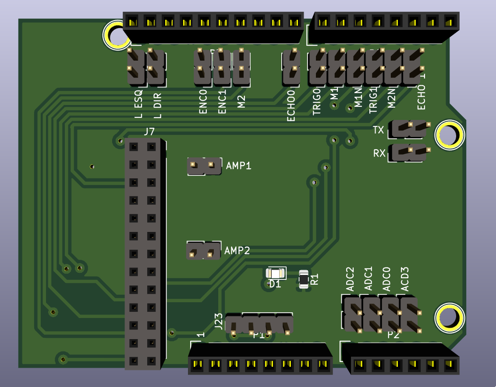
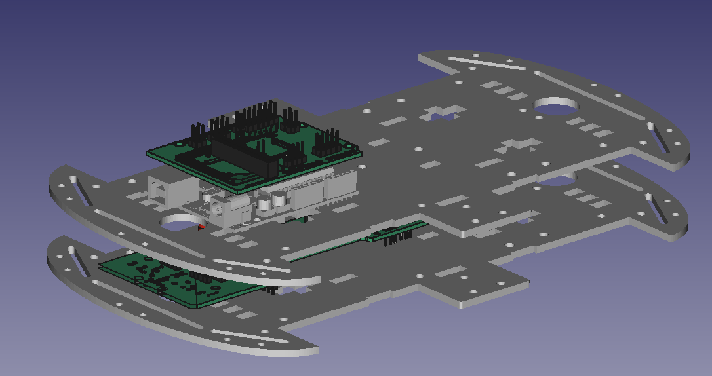
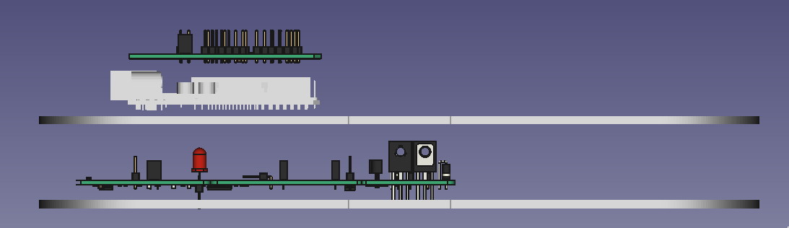

# Interface shield

This shield connects Arduino Uno pins to the car's power board. Go to [Power Board](https://github.com/xtarke/avrlibs/tree/master/shields/carrinho_potencia) for more hardware information.

See [this schematic](schematic.pdf).

## Analog pins

| Analog input  | Arduino pin  | Board label  | Signal |
| ------------- | -------- | ------------ | ------ |
| ADC0          | A2       |   ADC0       | Bat0   |
| ADC1          | A1       |   ADC1       | Bat1   |
| ADC2          | A0       |   ADC2       | Ampop1 |
| ADC3          | A3       |   ADC3       | Ampop2 |

## Ultrasonic sensor

| Arduino Pin | Signal|
| ------- | ------|
| 8       | Echo0 |
| 7       | Trig0 |
| 2       | Echo1 |
| 4       | Trig1 |

## Motors

|Arduino Pin | Signal|  Board label |
| ---------- | ------| ------------ |
| 6          | PWM1  |  M1          |
| 5          | PWM1N |  M1N         |
| 11         | PWM2  |  M2          |
| 3          | PWM2N |  M2N         |

## Espeed econder

| Arduino Pin | Signal |  Board label |
| ----------- | ------ | ------------ |
| 13          | D0     | ENC0         |
| 12          | D1     | ENC1         |

## Optic sensor

| Arduino Pin | Signal | Board label |
| ----------- | ------ | ----------- |
| A4          | R_TCRT | R DIR       |
| A5          | L_TCRT | L ESQ       |

## UART

| MSP Pin | Signal |
| ------- | ------ |
| TX      | TX     |
| RX      | RX     |
