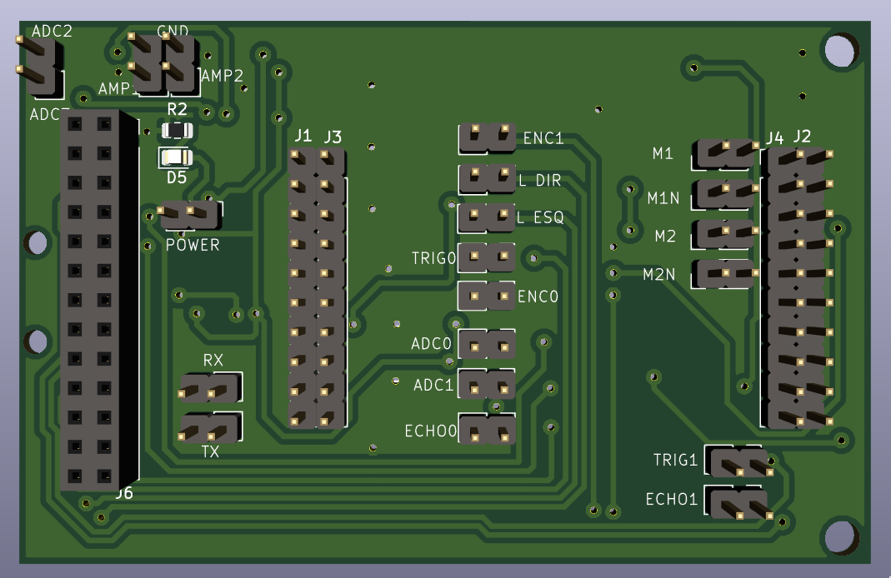
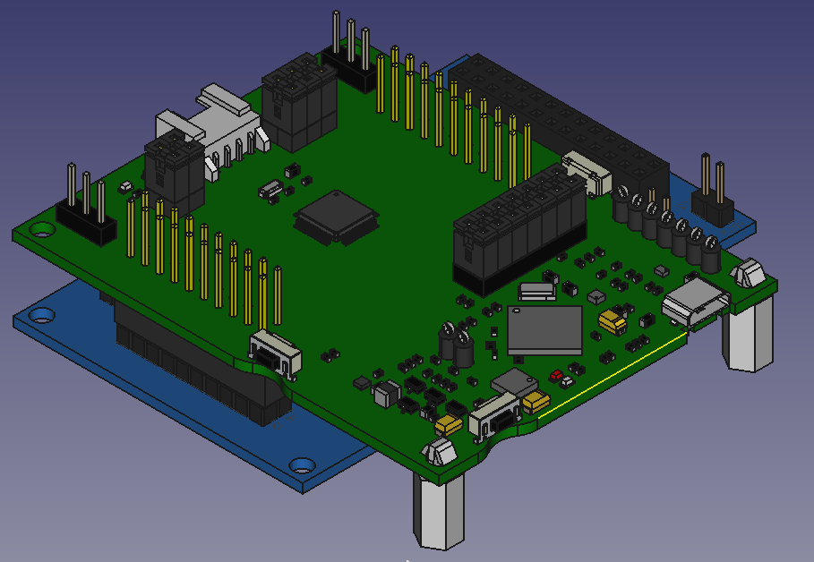
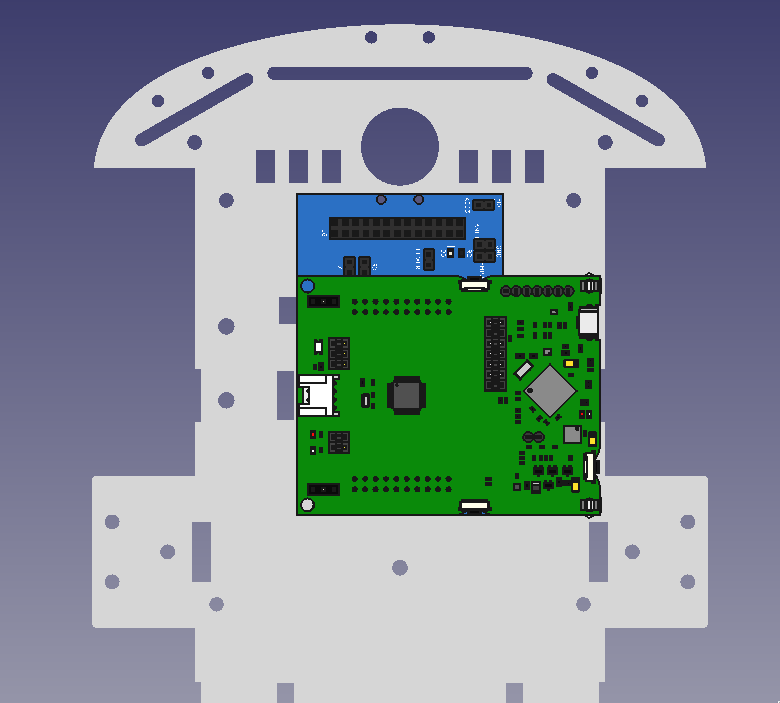
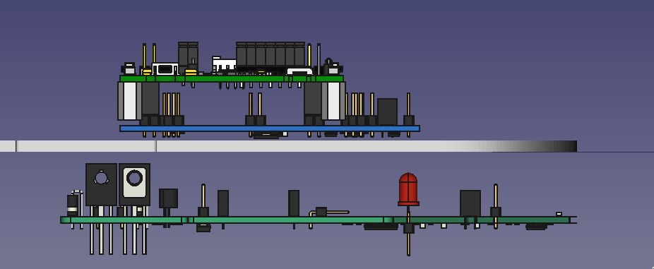

# Interface shield

This shield connects microcontroller (MSP-EXP430FR2355) pins to the car's power board. Go to [Power Board](https://github.com/xtarke/avrlibs/tree/master/shields/carrinho_potencia) for more hardware information.

See [this schematic](schematic.pdf).

## Analog pins

| Analog input  | MSP pin  | Board label  | Signal |
| ------------- | -------- | ------------ | ------ |
| A1            | P1.1     |   ADC0       | Bat0   |
| A2            | P1.2     |   ADC1       | Bat1   |
| ?             |  ?       |   ADC2       | Ampop1 |
| ?             |  ?       |   ADC3       | Ampop2 |

## Ultrasonic sensor

| MSP Pin | Signal|
| ----------- | ------|
| P2.0/TB1.1  | Echo0 |
| P2.2        | Trig0 |
| P2.1/TB1.2  | Echo1 |
| P2.4        | Trig1 |

## Motors

| MSP Pin    | Signal|  Board label |
| ---------- | ------| ------------ |
| P6.0/TB3.1 | PWM1  |  M1          |
| P6.1/TB3.2 | PWM1N |  M1N         |
| P6.2/TB3.3 | PWM2  |  M2          |
| P6.3/TB3.4 | PWM2N |  M2N         |

## Espeed econder

| MSP Pin | Signal |  Board label |
| ------- | ------ | ------------ |
| P5.0    | D0     | ENC0         |
| P5.1    | D1     | ENC1         |

## Optic sensor

| MSP Pin | Signal | Board label |
| ------- | ------ | ----------- |
| P5.4    | R_TCRT | R DIR       |
| P3.0    | L_TCRT | L ESQ       |

## UART

| MSP Pin | Signal |
| ------- | ------ |
| P1.7    | TX     |
| P1.6    | RX     |

## Assembly

Shield and EXP430FR2355 

Shield, EXP430FR2355 and chassi. 

Power board. Connection with 26 pin flat cable 
