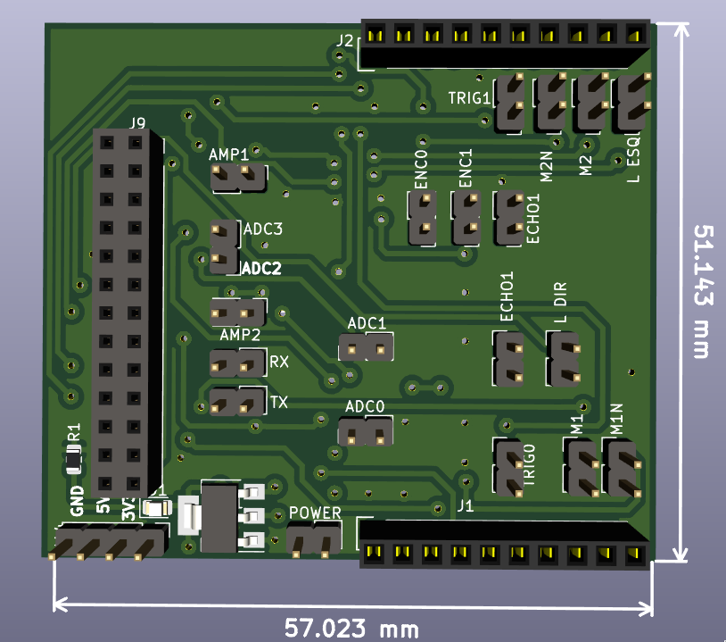
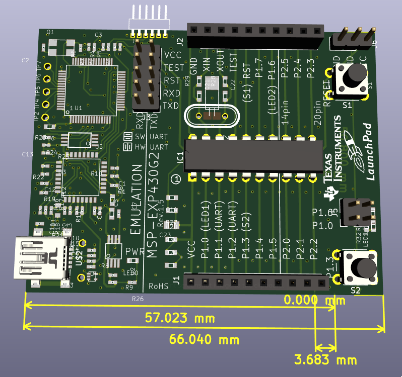
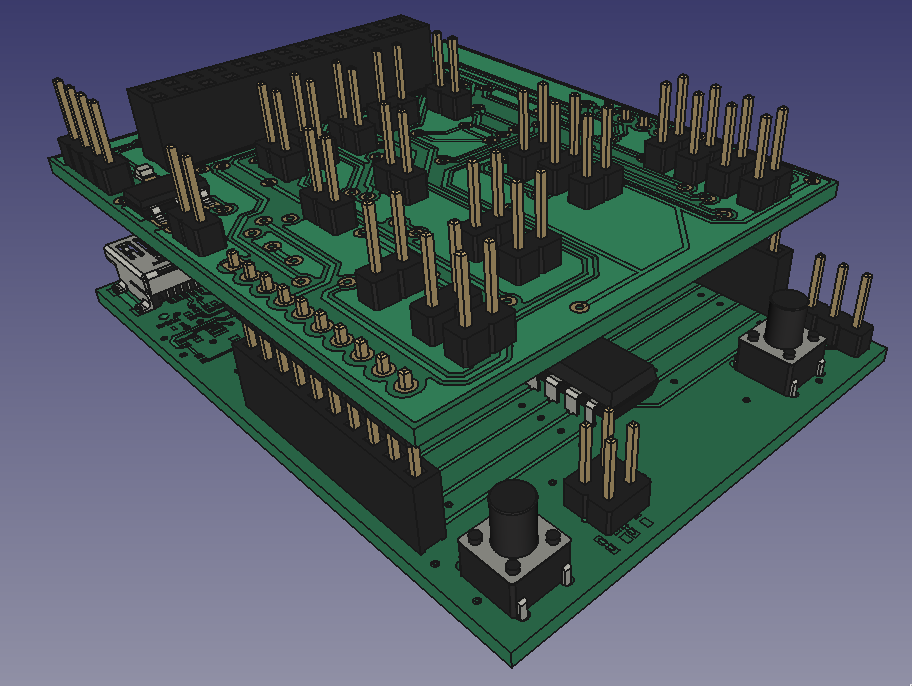
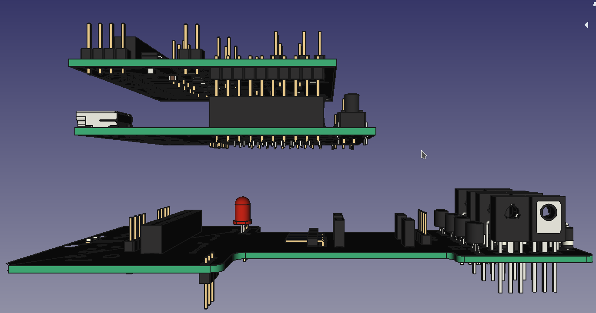

# Interface shield

This shield connects all microcontroller (MSP-EXP430G2 - MSP430G2553) pins to the car's power board. Go to [Power Board](https://github.com/xtarke/automated_buggy/tree/master/power_board) for more hardware information.

See [this schematic](schematic.pdf).

## Analog pins

| Analog input  | MSP pin  | Board label  | Signal |
| ------------- | -------- | ------------ | ------ |
| A0            | P1.0     |   ADC0       | Bat0   |
| A3            | P1.3     |   ADC1       | Bat1   |
| ?             |  ?       |   ADC2       | Ampop1 |
| ?             |  ?       |   ADC3       | Ampop2 |

## Ultrasonic sensor

| MSP Pin | Signal|
| ------- | ------|
| P1.5    | Echo0 |
| P1.4    | Trig0 |
| P1.6    | Echo1 |
| P1.7    | Trig1 |

## Motors

**Caution**, P2.1 and P2.2 are connected to the same timer comparator as well as P2.4 and P2.5.

| MSP Pin    | Signal|  Board label |
| ---------- | ------| ------------ |
| P2.1/TA1.1 | PWM1  |  M1          |
| P2.2/TA1.1 | PWM1N |  M1N         |
| P2.4/TA1.2 | PWM2  |  M2          |
| P2.5/TA1.2 | PWM2N |  M2N         |

## Espeed econder

| MSP Pin | Signal |  Board label |
| ------- | ------ | ------------ |
| P2.6    | D0     | ENC0         |
| P2.7    | D1     | ENC1         |

## Optic sensor

| MSP Pin | Signal | Board label |
| ------- | ------ | ----------- |
| P2.0    | R_TCRT | R DIR       |
| P2.3    | L_TCRT | L ESQ       |

## UART

| MSP Pin | Signal |
| ------- | ------ |
| P1.2    | TX     |
| P1.3    | RX     |

## Assembly

EXP430G2 with MSP430G2553 
Shield and EXP430G2 
Power board. Connection with 26 pin flat cable 
