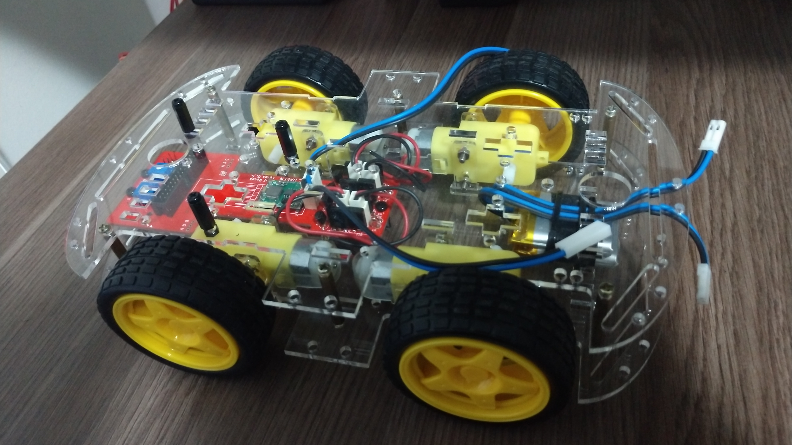
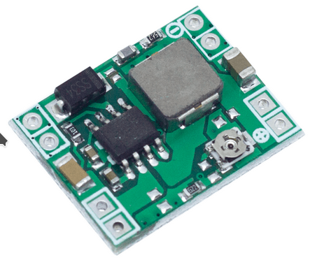
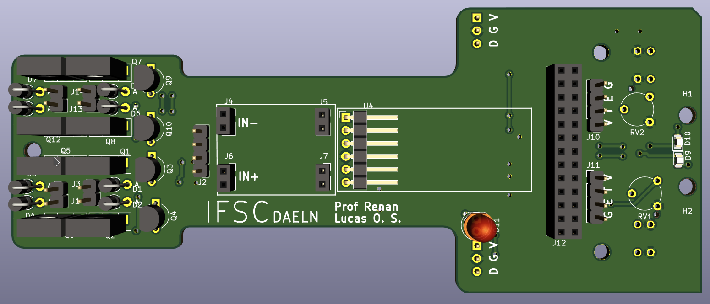

# Buggy AWD

Baseado em [Projeto PI3](https://github.com/luscasos/PI3-carro) de __Lucas Odair Silva.__

## Informações gerais

Projeto da placa eletrônica de potência para o acionamento de um Buggy 4x4. Um conector de 26-vias faz a conexão das seguintes placas:

- [Arduino Uno](./arduino/shield/)
- [MSP-EXP430G2](./msp430/shield_exp430g2)
- [MSP-EXP430FR2355](./msp430/shield_exp430fr2355)
- [Raspberry Pi](./rasp/)

## Características

- Controle independente dos motores (lado esquerdo e lado direito)
- Sensores de velocidade [Encoder](https://www.filipeflop.com/produto/sensor-de-velocidade-encoder/)
- Monitoramento de bateria de LiPo
- Sensor de linha dual
- Sensor ultrassom
- Comunicação Bluetooth (UART)

# Hardware

## Acionamento dos motores

Circuito final de alimentação dos motores, com queda de 0,4V de tensão na carga em relação a VCC e corrente de polarização externa de 640pA, não exigindo muita corrente do microcontrolador.

## Comunicação

## Aferição de velocidade

## Baterias
Para alimentar o carro foram escolhidas duas baterias de LIPO, de 3,7V e 1200mAh, conectadas em série, o que resulta em 7,4V de tensão.

## Regulador de tensão
Como o conjunto de baterias tem como tensão 7,4V na saída, é necessário baixar a tensão para níveis aceitáveis para o microcontrolador e modulo bluetooth, no caso foi usado um regulador ajustável Step-up-down, por questão de disponibilidade, mesmo esse sendo superdimensionado para a aplicação em questão, já que suporta correntes de até 5A e nesse caso não passa de 200mA.

## Medição da tensão das baterias
Como regra geral, não se pode descarregar uma bateria abaixo de uma certa tensão, com as usadas nesse projeto não é diferente, não sendo recomendado baixar a tensão da marca dos 3V, como o sistema possui duas baterias é necessário medir a tensão delas individualmente. O conversor analógico digital do microcontrolador tem como tensão base 3V, então é preciso baixar as tensões para menos de 3V, o circuito usado para isso é o diferencial com ampop, que pode dar um ganho menor que 1, sem usar tensão negativa. O Ampop escolhido foi o LM324, com ganho de 1/3 para a tensão superior (bateria 1 em serie com a bateria 2), e de 2/3 para a tensão media (bateria 1).

## Placa de circuito

